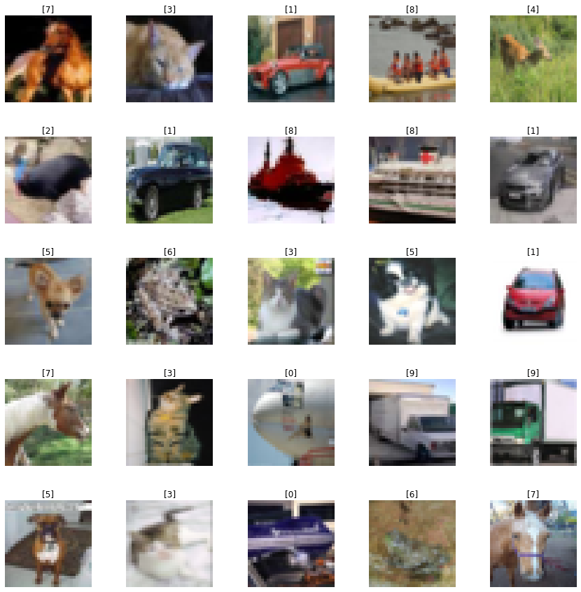
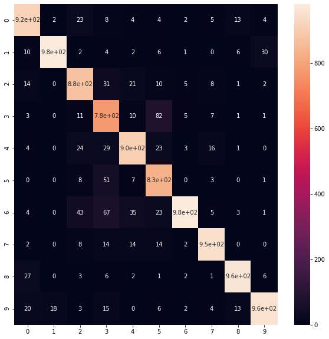

# Cifar-ImageClassification

## Overview

In this notebook I am creating an image classifier for the Cifar10 dataset which has an accuracy, precision, and recall of 91%. The Cifar10 dataset consists of 60k 32x32 pixel photos, of which 50k in the training set and 10k were used in the test set. The images are of:

1. airplanes
2. automobiles
3. birds
4. cats
5. deer
6. dogs
7. frogs
8. horses
9. ships
10. trucks

I'm accomplishing this by using a convolutional neural network with a custom architecture. The choices made for the architecture are explored in the notebook "Cifar_10_Choosing_CNN_Architecture.ipynb". Then I take an ensemble of 15 of these convolutional neural networks.

## Data

The data can be found inside the tensorflow package, tensorflow.keras.datasets.cifar10.load_data(). It contains 60k 32x32 pixel images in color. What makes this a challenging dataset to train on is the resolution of the images is low and the targets are broad categories where a person might have some difficulty identifying what's in the image due to the orientation/angle/perspective/portion of the object. Here is a sample of the photos for consideration:

Prepcrocessing this data set consisted of dividing the images by 255 so that the values lied in the interval 0 to 1. 

## Model

For this problem, I used an ensemble of 15 convolutional neural networks.

## Results

The following table and confusion matrix summarizes the results of the ensemble of
cnn models:

|              | precision | recall | f1-score | support |
|--------------|-----------|--------|----------|---------|
| airplanes    | 0.92      | 0.93   | 0.92     | 981     |
| automobiles  | 0.98      | 0.93   | 0.96     | 1041    |
| birds        | 0.88      | 0.90   | 0.89     | 967     |
| cats         | 0.78      | 0.87   | 0.89     | 895     |
| deer         | 0.91      | 0.90   | 0.90     | 1005    |
| dogs         | 0.83      | 0.92   | 0.87     | 901     |
| frogs        | 0.98      | 0.84   | 0.91     | 1159    |
| horses       | 0.95      | 0.95   | 0.95     | 1005    |
| ships        | 0.96      | 0.95   | 0.96     | 1010    |
| trucks       | 0.95      | 0.92   | 0.94     | 1036    |
|              |           |        |          |         |
| accuracy     |           |        | 0.91     | 10000   |
| macro avg    | 0.91      | 0.91   | 0.91     | 10000   |
| weighted avg | 0.92      | 0.91   | 0.91     | 10000   |

According to http://rodrigob.github.io/are_we_there_yet/build/classification_datasets_results.html, the results of this model are competititive with research papers puplished in 2014-2015

## References

The methodology for designing the CNN architecture for the Cifar10 dataset
was based on the github tutorial by Chris Deotte's MNIST notebook on Kaggle:
https://www.kaggle.com/cdeotte/how-to-choose-cnn-architecture-mnist